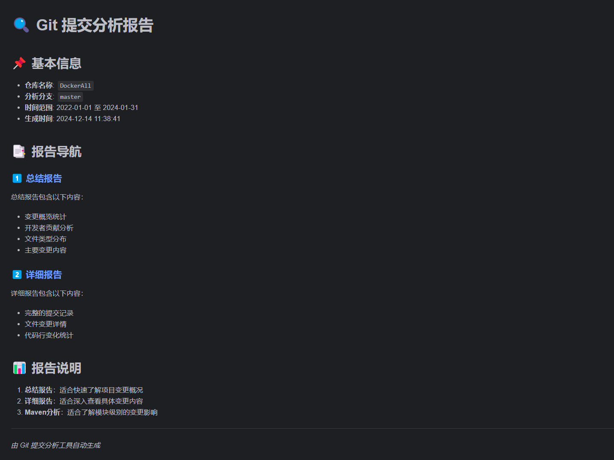
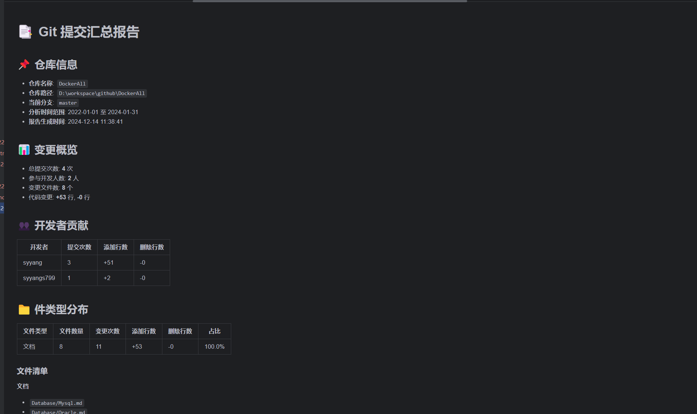
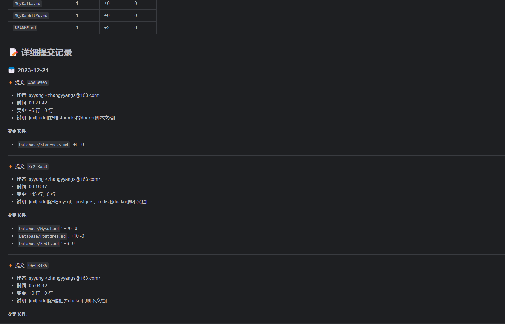
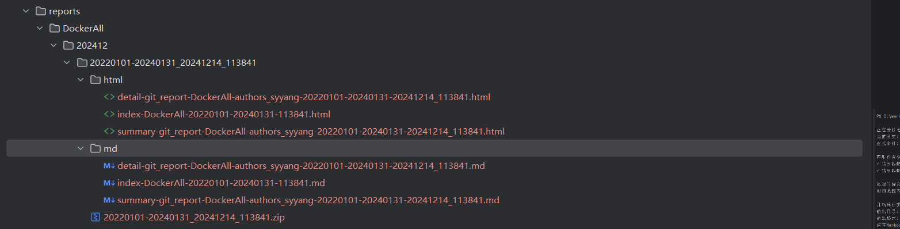
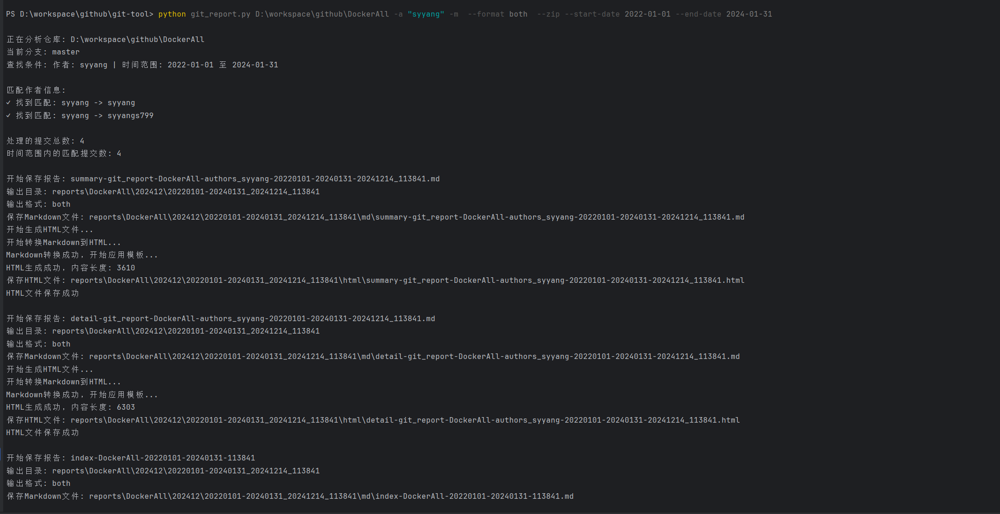
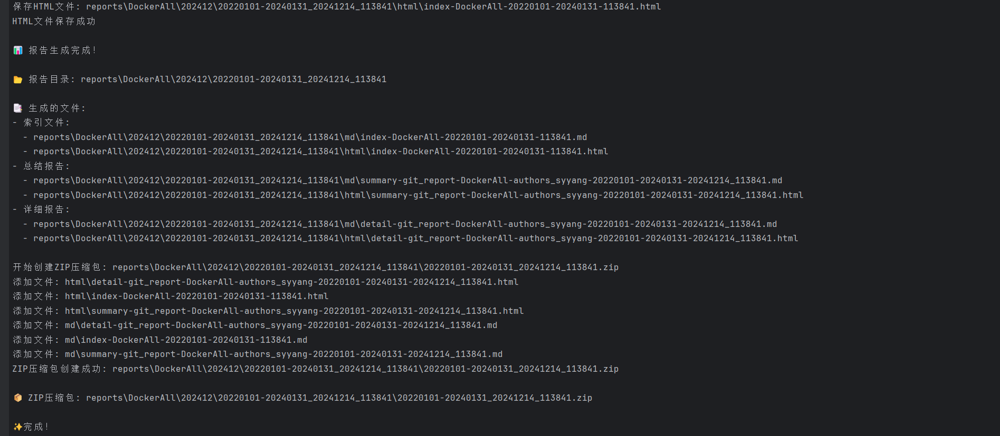

# Git 提交分析工具

一个功能强大的 Git 仓库分析工具，可以生成详细的提交报告，支持 Markdown 和 HTML 格式。

## 功能特点

- 📊 生成详细的提交统计报告
- 👥 开发者贡献分析
- 📁 文件变更分析
- 📦 Maven 项目模块分析
- 🔍 灵活的时间范围筛选
- 🎨 支持 Markdown 和 HTML 格式
- 📥 支持导出 ZIP 压缩包

## 效果展示

### 1. HTML 报告效果

#### 首页导航


#### 总结报告


#### 详细报告


### 2. Maven 项目分析效果

#### 模块概览
暂不提供截图

#### 模块详情
暂不提供截图

### 3. 目录结构


### 4. 命令行交互



## 安装依赖

```bash
pip install gitpython markdown2 pytz
```

## 使用方法

### 基本用法

```bash
python git_report.py <repo_path> [options]
```

### 常用选项

- `--format`, `-f`: 指定输出格式
  - `md`: 仅生成 Markdown 文件（默认）
  - `html`: 仅生成 HTML 文件
  - `both`: 同时生成 Markdown 和 HTML 文件

- `--date`, `-dt`: 使用日期快捷方式
  - `today`: 今天
  - `yesterday`: 昨天
  - `thisweek`: 本周
  - `lastweek`: 上周
  - `thismonth`: 本月
  - `lastmonth`: 上月

- `--start-date`: 开始日期（YYYY-MM-DD格式）
- `--end-date`: 结束日期（YYYY-MM-DD格式）
- `--branch`, `-b`: 指定分析的分支
- `--authors`, `-a`: 指定要分析的作者（支持多个）
- `--maven`, `-m`: 生成 Maven 项目分析报告
- `--zip`, `-z`: 创建 ZIP 压缩包

### 使用示例

1. 基本用法 - 分析最近一周的提交：
```bash
python git_report.py /path/to/repo
```

2. 分析指定日期范围：
```bash
python git_report.py /path/to/repo --start-date 2024-01-01 --end-date 2024-01-31
```

3. 分析特定分支和作者：
```bash
python git_report.py /path/to/repo -b main -a "张三" "李四"
```

4. 生成 HTML 格式报告并打包：
```bash
python git_report.py /path/to/repo --format html --zip
```

5. 生成 Maven 项目分析：
```bash
python git_report.py /path/to/repo --maven --format both
```

6. 使用日期快捷方式：
```bash
# 分析今天的提交
python git_report.py /path/to/repo --date today --format both

# 分析本周的提交
python git_report.py /path/to/repo --date thisweek --format html

# 分析上月的提交
python git_report.py /path/to/repo --date lastmonth --format both --zip
```

7. 复杂场景组合：
```bash
# 分析指定分支的Maven项目，生成HTML报告并打包
python git_report.py /path/to/repo -b develop --maven --format html --zip

# 分析特定作者在本月的提交，并生成完整报告
python git_report.py /path/to/repo --date thismonth -a "张三" --format both --zip

# 分析多个作者在指定时间范围的提交
python git_report.py /path/to/repo --start-date 2024-01-01 --end-date 2024-01-31 -a "张三" "李四" "王五" --format both

# 查看可用的分支和作者
python git_report.py /path/to/repo --list-branches
python git_report.py /path/to/repo --list-authors
```

### 输出目录结构

```
reports/
└── repo_name/
    └── YYYYMM/
        └── branch_daterange_timestamp/
            ├── html/
            │   ├── index.html
            │   ├── summary.html
            │   └── detail.html
            ├── md/
            │   ├── index.md
            │   ├── summary.md
            │   └── detail.md
            └── report.zip
```

## 报告内容

1. **索引文件**：提供报告导航和基本信息
   - 仓库基本信息
   - 报告文件导航
   - 快速链接

2. **总结报告**：包含变更概览和统计信息
   - 提交统计
   - 开发者贡献
   - 文件类型分布
   - 主要变更内容

3. **详细报告**：包含完整的提交记录
   - 按日期组织的提交记录
   - 文件变更详情
   - 代码行变化统计

4. **Maven分析**（可选）：包含项目结构分析
   - 模块依赖关系
   - 模块影响范围
   - 文件类型分类
   - 变更清单

## 注意事项

1. 确保已安装所有必需的依赖包
2. 确保有足够的权限访问目标 Git 仓库
3. 对于大型仓库，首次分析可能需要较长时间
4. ZIP 压缩包会包含所有生成的报告文件
5. HTML 报告支持在浏览器中直接查看，无需额外工具
6. Markdown 报告可以在任何支持 Markdown 的编辑器中查看

## 许可证

MIT License